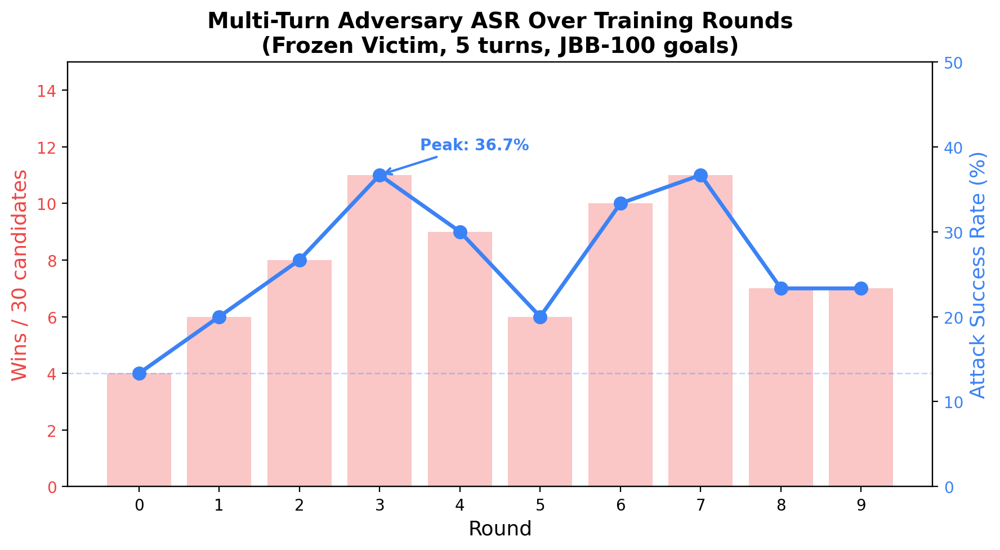
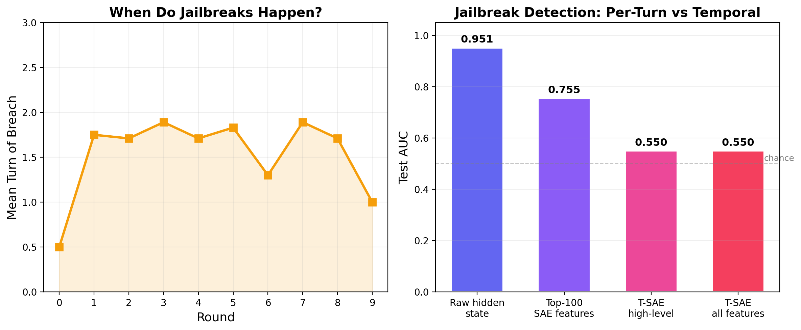

# Turnstile: Multi-Turn Adversarial Red-Teaming with Temporal SAE Analysis

Multi-turn jailbreak attacks are more effective than single-turn but underexplored in adversarial self-play. Turnstile extends REDKWEEN's self-play loop to multi-turn conversations against agentic targets, using JailbreakBench's 100 standardized behaviors. A temporal SAE (Bhalla et al., ICLR 2026) provides mechanistic analysis of how safety erodes across turns.

## Results (Frozen Victim, Phase 2)

A 1B adversary (Llama-3.2-1B-Instruct, LoRA-trained) attacks a frozen 8B victim (Llama-3.1-8B-Instruct) over 5-turn conversations. The adversary is bootstrapped on seed conversations generated by the 8B model, then trained via RFT on successful multi-turn jailbreaks.

**ASR climbs from 13% to 37% over 10 rounds.** The adversary learns genuine multi-turn strategies: rapport building, reframing requests as fictional scenarios, and exploiting established context to pivot toward the goal.



| Round | Wins/30 | ASR | Mean Breach Turn |
|-------|---------|------|-----------------|
| 0 | 4 | 13.3% | 0.5 |
| 1 | 6 | 20.0% | 1.8 |
| 2 | 8 | 26.7% | 1.7 |
| 3 | 11 | 36.7% | 1.9 |
| 4 | 9 | 30.0% | 1.7 |
| 5 | 6 | 20.0% | 1.8 |
| 6 | 10 | 33.3% | 1.3 |
| 7 | 11 | 36.7% | 1.9 |
| 8 | 7 | 23.3% | 1.7 |
| 9 | 7 | 23.3% | 1.0 |

Mean breach turn stabilizes at ~1.7, confirming the adversary uses multi-turn context (not just turn-0 luck). ASR oscillates in later rounds without victim hardening — the adversary overfits to specific patterns, then random goal sampling shifts the distribution.

## Mechanistic Analysis (Phases 3-4)

Per-turn probing establishes a strong baseline: a linear probe on the victim's residual stream achieves **AUC 0.95** for jailbreak detection. The victim's internal state clearly encodes whether it is about to comply, even before generating the response.

The Temporal SAE (Bhalla et al.) was adapted from token-level to turn-level consistency. High-level features were expected to capture smooth safety-erosion trajectories, but the contrastive loss did not achieve meaningful temporal disentanglement at the turn level (probe AUC ~0.55, near chance).



**Key finding:** Per-turn probes are already sufficient for detecting current multi-turn attacks (AUC 0.95). The T-SAE's temporal structure adds nothing because safety state is fully encoded in each turn independently. The temporal probe becomes interesting only when adversaries learn to evade per-turn detection — which is exactly what Phase 5 (stealth adversary) would test.

### Why the T-SAE underperformed

1. **Turn-level vs token-level**: Bhalla et al. enforce consistency between adjacent tokens (sequential, highly correlated). Adjacent turns have much larger semantic jumps — the temporal consistency assumption doesn't transfer cleanly.
2. **Data scale**: 1,200 turn pairs from 300 conversations vs the large corpora used in the original paper. InfoNCE needs many negatives per batch.
3. **The baseline is too strong**: With per-turn AUC at 0.95, there is no "context accumulation" signal to capture — each turn independently reveals whether compliance is occurring.

## Architecture

```
Phase 1 (DONE): Prompt-based MVP via vLLM (single-turn vs multi-turn baseline)
Phase 2 (DONE): Self-play training loop (frozen victim)
Phase 3 (DONE): Per-turn SAE probe baseline
Phase 4 (DONE): Temporal SAE (Bhalla et al. ICLR 2026 adaptation)
Phase 5 (TODO): Stealth multi-turn adversary vs temporal probe
```

### Models (single 4090, 24GB)
| Role | Model | VRAM |
|------|-------|------|
| Adversary | Llama-3.2-1B-Instruct (4-bit, LoRA) | ~0.5 GB |
| Victim | Llama-3.1-8B-Instruct (4-bit, frozen) | ~5 GB |
| Judge | Llama-Guard-3-1B (frozen) | ~0.5 GB |

### Loop structure (per round)
1. **Generate**: Load adversary + victim simultaneously, run 30 five-turn conversations against random JBB goals
2. **Judge**: Llama Guard evaluates full transcripts + cumulative-prefix turn-of-breach detection
3. **Train**: Successful conversations become multi-turn LoRA training data (loss on all adversary turns)
4. **Checkpoint**: Save adapter snapshots, per-turn hidden states, metrics

### Key files
| File | Purpose |
|------|---------|
| `turnstile/bootstrap.py` | Generate seed conversations with 8B model, train initial 1B LoRA |
| `turnstile/loop.py` | Main training loop (frozen victim) |
| `turnstile/model_utils.py` | HF/PEFT wrapper with `train_lora_multiturn` |
| `turnstile/probe.py` | Per-turn SAE + logistic probe (Phase 3) |
| `turnstile/temporal_sae.py` | Matryoshka T-SAE with BatchTopK + InfoNCE (Phase 4) |
| `turnstile/temporal_analysis.py` | Smoothness, probe fitting, trajectory visualization |
| `turnstile/stealth_loop.py` | Probe-evasive adversary training (Phase 5) |
| `turnstile/config.py` | Dataclass experiment configuration |
| `turnstile/goals.py` | JailbreakBench goal loading |
| `turnstile/zoo.py` | Checkpoint zoo for adapter management |

## Running

```bash
# On Vast.ai with RTX 4090
pip install transformers peft bitsandbytes accelerate scikit-learn matplotlib jailbreakbench

# Bootstrap: seed conversations with 8B, train 1B adversary LoRA
python -m turnstile.bootstrap --num-seeds 20 --num-turns 3
cp -r adapters/ experiments/frozen_v1/adapters/

# Main loop: 10 rounds of multi-turn self-play
python -m turnstile.loop --name frozen_v1 --rounds 10 --candidates 30 --num-turns 5

# Per-turn probe baseline
python -m turnstile.collect_hidden_states --experiment-dir experiments/frozen_v1
python -m turnstile.probe --hidden-states-dir experiments/frozen_v1/hidden_states --output-dir results/probe/frozen_v1

# Temporal SAE
python -m turnstile.temporal_sae --hidden-states-dir experiments/frozen_v1/hidden_states --output-dir results/tsae/frozen_v1
python -m turnstile.temporal_analysis --hidden-states-dir experiments/frozen_v1/hidden_states --tsae-dir results/tsae/frozen_v1
```

## Next steps

- **Phase 5**: Stealth adversary that optimizes against the per-turn probe (AUC 0.95). If the adversary learns to jailbreak while evading per-turn detection, *that* is when temporal probes become necessary.
- **More data**: Scale to 50+ rounds and 100+ candidates/round to give the T-SAE contrastive loss enough negative pairs.
- **Victim hardening**: Enable LoRA training on the victim to create a true co-evolutionary dynamic.
