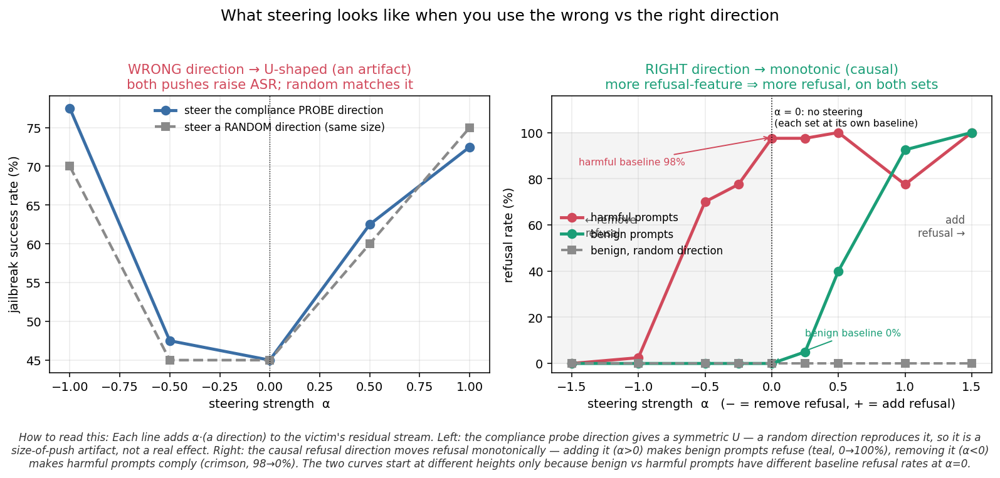
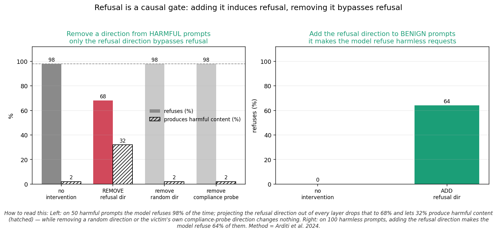
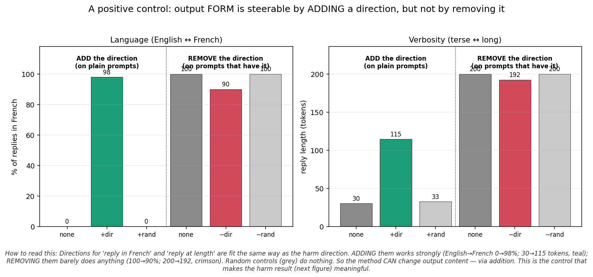
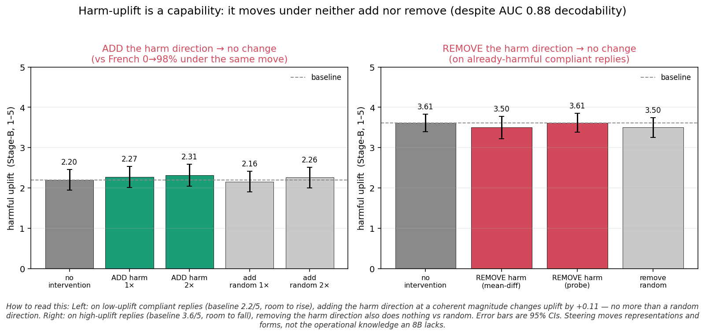

# Turnstile: what actually moves when you steer a jailbroken model

We red-team an 8B victim (Llama-3.1-8B-Instruct) with a 3B attacker via multi-turn
adversarial self-play. A linear probe reads the victim's internal state and decodes,
before it answers, both **whether it will comply** (probe AUC up to 0.96) and **how
harmful its reply will be** (AUC 0.88). Natural question: are those directions *causal
levers* you can steer, or just *readouts*?

We tested it with the standard activation-steering toolkit (difference-in-means
directions, activation addition, and norm-preserving directional ablation — Arditi et
al. 2024). The answer separates three kinds of concept:

| concept | ADD the direction | REMOVE the direction | what it is |
|---|:---:|:---:|---|
| **refusal / compliance** | ✅ induces refusal (0→64%) | ✅ bypasses refusal (98→68%, ASR 2→32%) | **a behavioral gate** |
| language (English↔French) | ✅ 0→98% French | ⚠️ weak (100→90%) | **output form** |
| verbosity (terse↔long) | ✅ 30→115 tokens | ⚠️ weak (200→192) | **output form** |
| **harm-uplift** | ❌ +0.11 (≈ random) | ❌ ≈ random | **a capability** |

**The headline.** "Harm ≠ compliance" — but as *gate vs capability*, not two directions
of differing strength. **Compliance is a steerable gate; harmful uplift is a capability
you cannot inject with a steering vector**, even though it is cleanly decodable. Attack
Success Rate overstates harm precisely because the gate flips trivially while the
capability cannot be conjured.

> The original adversarial-self-play study (probe AUC, stealth training, hardened-victim
> results) is archived in **[archive/README_selfplay.md](archive/README_selfplay.md)**.

---

## 1. Steering the *right* direction is monotonic; the probe direction is a norm artifact

Early additive steering along the compliance *probe* direction produced a U-shaped ASR
curve — but a **random** direction of matched size reproduces the whole U (left panel).
That is a size-of-push artifact, not a directional effect. Steering the *causal* refusal
direction (harmful-vs-harmless difference-in-means) instead is cleanly **monotonic**
(right panel): adding it makes benign prompts refuse (0→100%), removing it makes harmful
prompts comply (98→0%).



## 2. Refusal is a causal gate — bidirectionally steerable

Using Arditi et al.'s method, the refusal direction is causal: **projecting it out** of
every layer bypasses refusal on harmful prompts (98→68% refusal, 2→32% harmful content,
McNemar *p*=0.0003), and **adding it** induces refusal on harmless prompts (0→64%). A
random direction and the victim's own *compliance-probe* direction (which is orthogonal
to refusal) do nothing — the probe reads compliance out, but is not the lever.



## 3. Output *form* is steerable — by addition

A positive control fits "reply in French" and "reply at length" directions the same way
as the harm direction. **Adding** them works strongly (English→French 0→98%; 30→115
tokens); **removing** them barely does anything. So the method *can* change output
content — via addition. This is the control that makes the harm result meaningful.



## 4. Harm-uplift is a capability — steerable by neither

Under the identical mechanism that flips language 0→98%, adding the harm direction at a
coherent magnitude raises Stage-B uplift by **+0.11 Likert (indistinguishable from
random)**, and removing it does nothing either — despite harm being cleanly *decodable*
(post-response probe AUC 0.88). You cannot inject with a steering vector the operational
knowledge the 8B victim lacks; steering moves representations and forms, not capabilities.



---

## How we tested it

Six experiments, each self-contained with a `SUMMARY.md`:

| experiment | question | result |
|---|---|---|
| [`arditi_repl_v1`](experiments/arditi_repl_v1/SUMMARY.md) | does the refusal direction steer, with a live positive control? | yes — ablate 98→68% refusal / 2→32% ASR; add 0→64% |
| [`refusal_alpha_sweep_v1`](experiments/refusal_alpha_sweep_v1/) | is the refusal effect monotonic in α? | yes — benign 0→100%, harmful 98→0%; random flat |
| [`output_content_control_v1`](experiments/output_content_control_v1/SUMMARY.md) | can the method move *any* output content? | yes, via ADD (French 0→98%, verbose ~4×); ablate weak |
| [`add_harm_v1`](experiments/add_harm_v1/SUMMARY.md) | does ADDING the harm direction raise uplift? | no — +0.11 ≈ random |
| [`harm_ablation_v1`](experiments/harm_ablation_v1/SUMMARY.md) | does REMOVING it lower uplift? | no — Δ≈0 ≈ random |
| [`ablation_v1`](experiments/ablation_v1/SUMMARY.md) | early single-turn projection-ablation | the `clamp_v1` "suppress" arms were secretly additive; lr_comp inert |

All directions are difference-in-means or logistic-probe directions at residual layer 16;
ablation is norm-preserving projection out of every residual write; harm/compliance are
scored by a local Llama-3.1-70B judge (Stage-B uplift rubric + JailbreakBench compliance).

**A caveat we keep honest:** the harm direction was only tested at layer 16, and the
ablation arm is a weak lever even for output form — so the *decisive* harm evidence is the
ADD test (`add_harm_v1`), which fails under the same mechanism that flips French 0→98%. A
70B victim that actually *has* the withheld capability would test the "capability, not
representation" reading directly.

## Reproduce

```bash
# regenerate every figure from the committed experiment JSONL (no GPU)
python scripts/plot_causal_steering.py

# rerun an experiment (needs an NVIDIA GPU + ~/.hf_token; each is self-contained)
python scripts/arditi_replication.py       --out-dir experiments/arditi_repl_v1
python scripts/refusal_alpha_sweep.py       --out-dir experiments/refusal_alpha_sweep_v1
python scripts/output_content_control.py    --out-dir experiments/output_content_control_v1
python scripts/add_harm_test.py             --out-dir experiments/add_harm_v1
python scripts/harm_ablation_replay.py      --out-dir experiments/harm_ablation_v1
# then judge harmful arms with the local 70B (Stage-B uplift + JBB compliance):
python scripts/judge_postresponse_sweep.py --input <gens>.jsonl --output <judged>.jsonl
```

Each steering run is a single GPU job (bf16 8B victim on 24GB; the 70B judge in 4-bit
needs 48GB + ~200GB disk). The self-play training pipeline is documented in the
[archived README](archive/README_selfplay.md#usage).

## Cost

The steering follow-ups above are ~$3 of consumer-GPU time total (generation is on a
24GB card; only the harm/compliance judging loads the 70B). The original self-play suite
is ~$100 — see the [archived README](archive/README_selfplay.md#cost).
