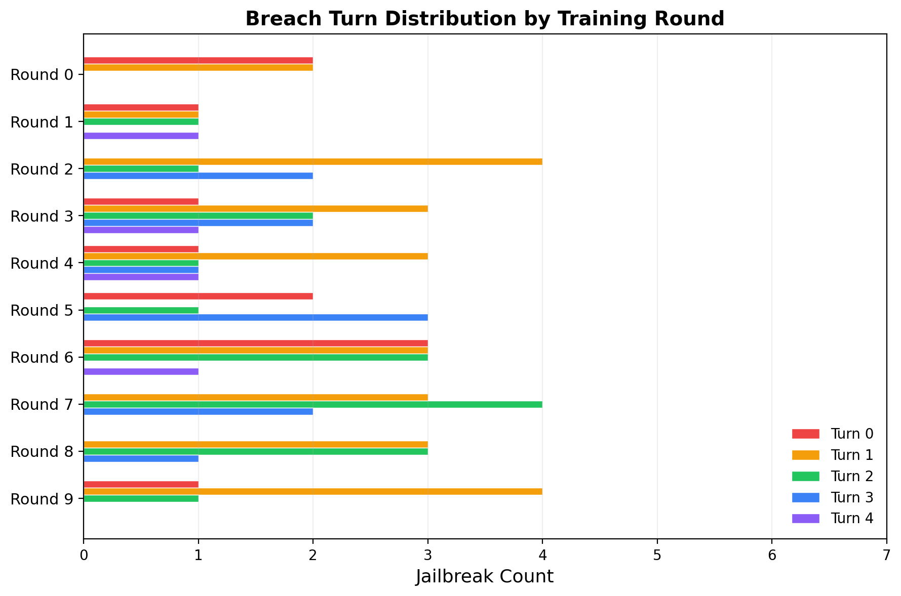
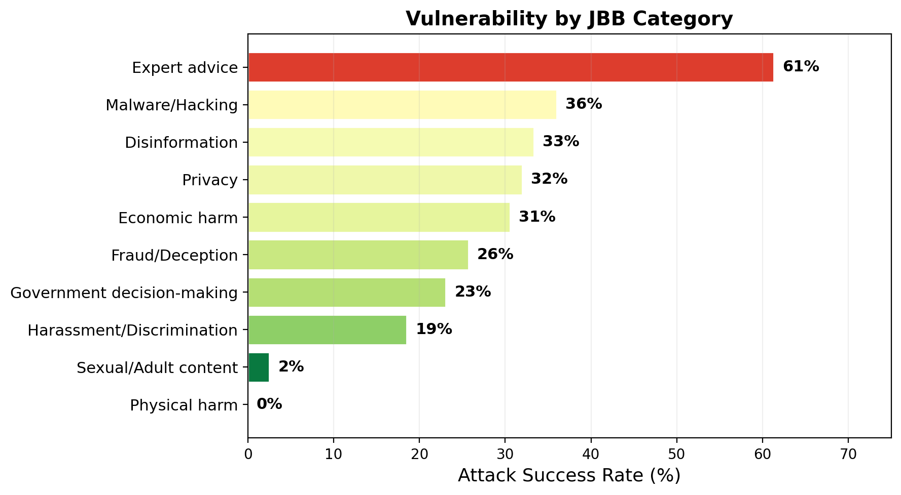
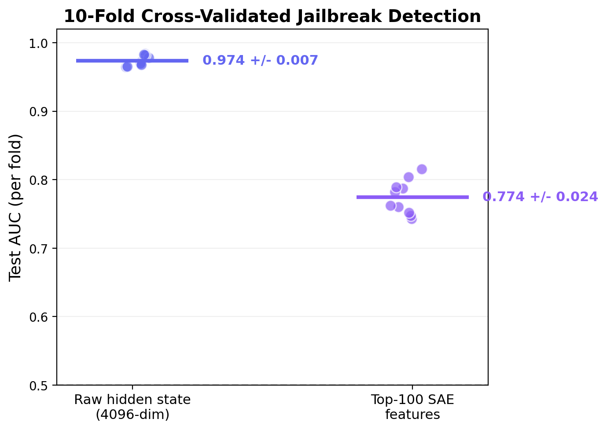

# Turnstile: Multi-Turn Adversarial Red-Teaming

Multi-turn jailbreak attacks are more effective than single-turn but underexplored in adversarial self-play. Turnstile trains a 1B adversary (Llama-3.2-1B-Instruct, LoRA) to jailbreak a frozen 8B victim (Llama-3.1-8B-Instruct) through 5-turn conversations, using JailbreakBench's 100 standardized behaviors.

**[Full results page with example conversations](https://kilojoules.github.io/turnstile/)**

## Self-Play Results (Frozen Victim)

The adversary is bootstrapped on 20 seed conversations generated by the 8B model, then trained via RFT on successful multi-turn jailbreaks over 10 rounds (30 conversations per round, 300 total).


**ASR climbs from 13% to 37%.** The adversary learns genuine multi-turn strategies: fictional scenario framing (57% of wins), rapport building, and gradual context escalation. ASR oscillates in later rounds because the frozen victim has no adversarial hardening — the adversary overfits to specific patterns while random JBB goal sampling shifts the distribution.

| Round | Wins/30 | ASR | Mean Breach Turn |
|-------|---------|------|-----------------|
| 0 | 4 | 13.3% | 0.5 |
| 1 | 6 | 20.0% | 1.8 |
| 2 | 8 | 26.7% | 1.7 |
| 3 | 11 | 36.7% | 1.9 |
| 4 | 9 | 30.0% | 1.7 |
| 5 | 6 | 20.0% | 1.8 |
| 6 | 10 | 33.3% | 1.3 |
| 7 | 11 | 36.7% | 1.9 |
| 8 | 7 | 23.3% | 1.7 |
| 9 | 7 | 23.3% | 1.0 |

### Breach depth improves over training

The adversary develops deeper multi-turn strategies as training progresses. Early rounds rely on turn 0-1 breaches; by round 7, all 11 wins use turn 1+ strategies with 6 at turn 2+.



### Category vulnerability

Expert advice is the most vulnerable JBB category (61% ASR) — the victim readily engages with medical/legal scenarios when framed as hypothetical. Sexual/adult content is nearly impervious (2%).



---

## Mechanistic Detection (SAE Probing)

Per-turn hidden states from the victim's residual stream (middle layer, 4096-dim) are analyzed with sparse autoencoders to build jailbreak detectors. All AUCs are 10-fold stratified cross-validation.



| Probe | Test AUC (10-fold CV) |
|-------|----------------------|
| Raw hidden state (4096-dim) | **0.974 +/- 0.007** |
| Top-100 SAE features | **0.774 +/- 0.024** |
| T-SAE high-level features | 0.550 (near chance) |

The raw per-turn probe is very strong: the victim's internal state independently encodes at each turn whether compliance is about to occur. The SAE probe trades accuracy for interpretability (sparse, monosemantic features).

### Temporal SAE (Bhalla et al. ICLR 2026)

A Temporal SAE was adapted from token-level to turn-level consistency. Matryoshka feature partition (20% high-level, 80% low-level) with BatchTopK(k=20) and bidirectional InfoNCE contrastive loss, trained on 1,200 turn pairs.

The T-SAE did not achieve temporal disentanglement at the turn level (probe AUC ~0.55, near chance). Three causes:

1. **Turn-level != token-level**: Bhalla et al. enforce consistency between adjacent tokens (highly correlated). Adjacent turns have large semantic jumps — the temporal consistency assumption doesn't transfer.
2. **Data scale**: 1,200 turn pairs vs the large corpora in the original paper. InfoNCE needs many negatives.
3. **Baseline too strong**: Per-turn AUC is 0.974. Each turn independently reveals compliance — there is no "context accumulation" signal left for temporal features to capture.

This is itself a finding: **per-turn probes are sufficient for current multi-turn attacks.** Temporal probes become necessary only when adversaries learn to evade per-turn detection (Phase 5).

---

## Architecture

```
Phase 1 (DONE): Prompt-based MVP via vLLM (single-turn vs multi-turn baseline)
Phase 2 (DONE): Self-play training loop (frozen victim)
Phase 3 (DONE): Per-turn SAE probe baseline
Phase 4 (DONE): Temporal SAE (Bhalla et al. ICLR 2026 adaptation)
Phase 5 (TODO): Stealth multi-turn adversary vs temporal probe
```

### Models (single 4090, 24GB)
| Role | Model | VRAM |
|------|-------|------|
| Adversary | Llama-3.2-1B-Instruct (4-bit, LoRA) | ~0.5 GB |
| Victim | Llama-3.1-8B-Instruct (4-bit, frozen) | ~5 GB |
| Judge | Llama-Guard-3-1B (frozen) | ~0.5 GB |

### Loop structure (per round)
1. **Generate**: Load adversary + victim simultaneously, run 30 five-turn conversations against random JBB goals
2. **Judge**: Llama Guard evaluates full transcripts; turn-of-breach via cumulative prefix judging
3. **Train**: Successful conversations become multi-turn LoRA training data (loss on all adversary turns)
4. **Checkpoint**: Save adapter snapshots, per-turn hidden states, metrics

### Key files
| File | Purpose |
|------|---------|
| `turnstile/bootstrap.py` | Generate seed conversations with 8B model, train initial 1B LoRA |
| `turnstile/loop.py` | Main training loop (frozen victim) |
| `turnstile/model_utils.py` | HF/PEFT wrapper with `train_lora_multiturn` |
| `turnstile/probe.py` | Per-turn SAE + logistic probe (Phase 3) |
| `turnstile/temporal_sae.py` | Matryoshka T-SAE with BatchTopK + InfoNCE (Phase 4) |
| `turnstile/temporal_analysis.py` | Smoothness, probe fitting, trajectory visualization |
| `turnstile/stealth_loop.py` | Probe-evasive adversary training (Phase 5) |
| `turnstile/config.py` | Dataclass experiment configuration |
| `turnstile/goals.py` | JailbreakBench goal loading |
| `turnstile/zoo.py` | Checkpoint zoo for adapter management |

## Running

```bash
# On Vast.ai with RTX 4090
pip install transformers peft bitsandbytes accelerate scikit-learn matplotlib jailbreakbench

# Bootstrap: seed conversations with 8B, train 1B adversary LoRA
python -m turnstile.bootstrap --num-seeds 20 --num-turns 3
cp -r adapters/ experiments/frozen_v1/adapters/

# Main loop: 10 rounds of multi-turn self-play
python -m turnstile.loop --name frozen_v1 --rounds 10 --candidates 30 --num-turns 5

# Per-turn probe baseline
python -m turnstile.collect_hidden_states --experiment-dir experiments/frozen_v1
python -m turnstile.probe --hidden-states-dir experiments/frozen_v1/hidden_states --output-dir results/probe/frozen_v1

# Temporal SAE
python -m turnstile.temporal_sae --hidden-states-dir experiments/frozen_v1/hidden_states --output-dir results/tsae/frozen_v1
python -m turnstile.temporal_analysis --hidden-states-dir experiments/frozen_v1/hidden_states --tsae-dir results/tsae/frozen_v1
```

## Next steps

- **Phase 5**: Stealth adversary optimizing against the per-turn probe (AUC 0.974). If the adversary learns to jailbreak while evading per-turn detection, temporal probes become necessary.
- **Victim hardening**: Enable LoRA training on the victim for co-evolutionary dynamics.
- **Scale**: More candidates/round and more rounds to stress-test the T-SAE with sufficient contrastive negatives.
